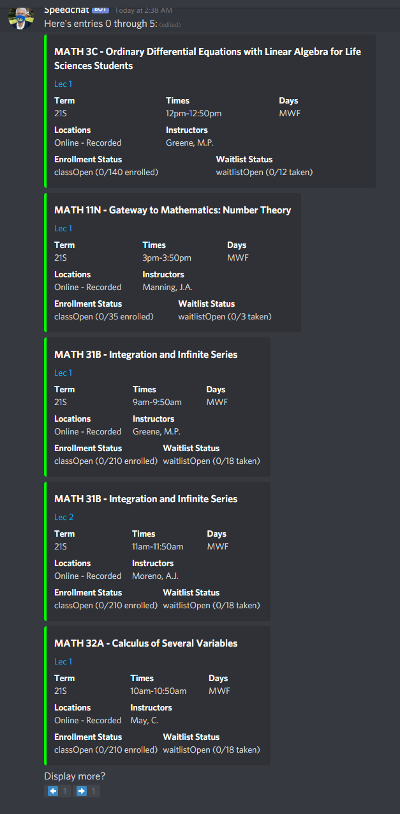

# OK, Find-a-class-and-Enroll-er

A Discord bot that can quickly look up and report UCLA course information. Also can keep track of enrollment status of classes, and message you when they're change from closed to open, etc.

My attempt at imitating Courscicle for specifically UCLA courses. Also might be nice for browsing around classes, it's quite a bit faster than MyUCLA.

## Commands List

### ~search_class

`~search_class SUBJECT CATALOG [--term TERM]`

Given a class name (subject + catalog number, i.e. MATH 151AH or COM SCI 32), spit out lots of revelant information.

If term isn't provided, defaults to whatever the default term is set to (can see with `~default_term`).

Then, asks user to react with an emoji choice, corresponding to whatever class they want to add to their watchlist.

### ~display_class

`~display_class SUBJECT CATALOG [--term TERM]`

Very similar to `search_class` (same format for arguments), but doesn't give emoji options, and instead displays description.

### ~subject

`~subject SUBJECT [--term TERM] [--deep]`

Displays all classes offered under the given subject in the given term, or default term if not provided.

If the `--deep` flag isn't provided, displays just the names of the classes offered, 10 at a time. You can scroll through more with the left and right arrow emojis.

However, if the `--deep` flag is provided, displays embeds for every offering of the each course, 5 at a time.

### ~see_watchlist

`~see_watchlist`

Displays embeds for each class in the command author's watchlist.

### ~remove_class

`~remove_class`

Shows all classes in command author's watchlist, and presents emoji choices if they want to remove one from the watchlist.

### ~clear_classes

`~clear_classes` 

Removes all classes from the command author's watchlist. This means they won't recieve any more notifications until more classes are readded. Helpful if you suspect some data in the watchlist got corrupted, like when you know you added classes to the list, but using `~see_watchlist` isn't working. 

### ~alias

`~alias ALIAS [--target TARGET]`

Adds an alias for a certain subject name to the command author's collection. This is meant to help people set more convenient and well-known shorthands for many subjects, like "CS" as opposed to "COM SCI". When an alias is set for a user, they will be able to look up classes with that alias.

### ~remove_alias

`~remove_alias ALIAS`

Unmaps the given alias.

### ~see_aliases

`~see_aliases`

Displays a small simple embed of all aliases you have set, if you have any.

